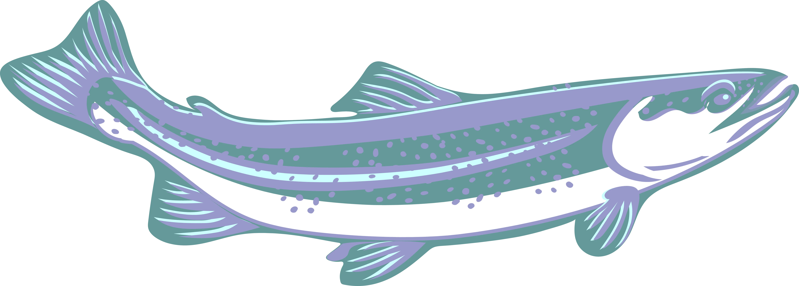

# Trout

Trout is a `Release to Production` tool for WordPress plugin updates. It operates in the same fashion as [Bowerbird](https://github.com/farghul/bowerbird.git), but with a focus on creating a WordPress production release via interaction with a Jira API. Trout is named after a popular catch and ***release*** fish.



## 📚 Prerequisites

The [Go Programming Language](https://go.dev "Build simple, secure, scalable systems with Go") installed to enable building executables from source code.

A number of JSON formatted files containing your API URLs and Basic tokens to enable authorized querying, ticket modification, and the creation of pull requests (see `jsons` folder for reference).

## 🔩 Function

Trout searches the targeted Jira API for tickets marked as `In Progress` (aka Testing) for more than seven days. It then gathers the qualifying candidates and creates a new git branch named `update/[release]` where *release* is provided as an argument. Finally, it runs a series of `composer require` commands on the `composer-prod.json` file and creates a pull request for review.

## 📂 Project Structure

Inside of your Bowerbird project, you'll see the following folders and files:

``` zsh
.
├── jsons/
│   ├── bitbucket.json
│   ├── jira.json
│   ├── tokens.json
├── go.mod
├── Jenkisfile
├── LICENSE.md
├── main.go
├── README.md
├── release.go
├── shared.go
├── trout.webp
└── vars.go
```

## 🚧 Build

Before building the application, change the value of these constants to reflect your environment:

``` go
repos  string = "/data/automation/checkouts/"
tokens string = "/data/automation/tokens/"
config string = "desso-automation-conf/jsons/"
```

Then, from the root folder containing `main.go`, use the command that matches your environment:

### Windows & Mac:

``` zsh
go build -o [name] .
```

### Linux:

``` zsh
GOOS=linux GOARCH=amd64 go build -o [name] .
```

## 🏃 Run

``` zsh
trout -r [release name or number]
```

## 🎏 Available Flags

| Command               | Action                      |
|:----------------------|:----------------------------|
|    `-h, --help`       |   Help information          |
|    `-r, --run`        |   Run program               |
|    `-v, --version`    |   Display program version   |

## 🎫 License

Code is distributed under [The Unlicense](https://github.com/farghul/trout/blob/main/LICENSE.md "Unlicense Yourself, Set Your Code Free") and is part of the Public Domain.
